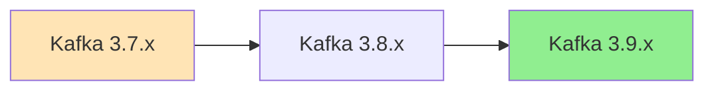

# 🔄 Kafka Cluster Upgrades Guide

This document provides comprehensive guidance for upgrading Kafka clusters deployed with this Helm chart, including Strimzi operator upgrades, Kafka version upgrades, and Kubernetes compatibility.

## 📋 Table of Contents

- [Compatibility Matrix](#compatibility-matrix)
- [Pre-Upgrade Checklist](#pre-upgrade-checklist)
- [Upgrade Types](#upgrade-types)
- [Kafka Version Upgrades](#kafka-version-upgrades)
- [Strimzi Operator Upgrades](#strimzi-operator-upgrades)
- [Helm Chart Upgrades](#helm-chart-upgrades)
- [Kubernetes Cluster Upgrades](#kubernetes-cluster-upgrades)
- [Rollback Procedures](#rollback-procedures)
- [Troubleshooting](#troubleshooting)

## 🔗 Compatibility Matrix

### Strimzi 0.47.x Compatibility

| Component | Version | Kubernetes Support | Notes |
|-----------|---------|-------------------|-------|
| **Strimzi Operator** | 0.47.0 | 1.25 - 1.31 | ⚠️ Last version to support K8s 1.25-1.26 |
| **Kafka** | 3.9.0 (default) | All supported K8s | Recommended for new deployments |
| **Kafka** | 3.8.x | All supported K8s | Supported for existing clusters |
| **Kafka** | 3.7.x | All supported K8s | Legacy support |

### Kubernetes Version Support

> ⚠️ **IMPORTANT**: Strimzi 0.47.x is the **last version** to support Kubernetes 1.25 and 1.26.
> Plan your Kubernetes upgrades accordingly.

| Kubernetes Version | Strimzi 0.47.x | Future Strimzi Versions |
|-------------------|----------------|------------------------|
| 1.25.x | ✅ Supported | ❌ Not supported |
| 1.26.x | ✅ Supported | ❌ Not supported |
| 1.27.x | ✅ Supported | ✅ Supported |
| 1.28.x | ✅ Supported | ✅ Supported |
| 1.29.x | ✅ Supported | ✅ Supported |
| 1.30.x | ✅ Supported | ✅ Supported |
| 1.31.x | ✅ Supported | ✅ Supported |

## ✅ Pre-Upgrade Checklist

Before starting any upgrade, ensure you have:

### 🔍 Assessment
- [ ] **Current versions documented**: Strimzi, Kafka, Kubernetes, Helm chart
- [ ] **Cluster health verified**: All brokers healthy, no under-replicated partitions
- [ ] **Backup strategy**: Topic configurations, user ACLs, and critical data backed up
- [ ] **Maintenance window**: Planned downtime window (if required)
- [ ] **Monitoring ready**: Metrics and alerting systems active

### 🛡️ Safety Measures
- [ ] **Test environment**: Upgrade tested in non-production environment first
- [ ] **Rollback plan**: Documented rollback procedures and tested
- [ ] **Client compatibility**: Verified client applications support target Kafka version
- [ ] **Network policies**: Reviewed and updated if necessary
- [ ] **Resource capacity**: Sufficient cluster resources for upgrade process

### 📊 Cruise Control (if enabled)
- [ ] **Rebalance status**: No active rebalances running
- [ ] **Goals configured**: Appropriate rebalance goals for upgrade scenario
- [ ] **Capacity planning**: Verified cluster can handle temporary broker unavailability

## 🔄 Upgrade Types

### 1. **Rolling Upgrades** (Recommended)
- Zero-downtime upgrades
- Brokers upgraded one at a time
- Requires proper replication factor (≥3)
- Client connections may experience brief interruptions

### 2. **Blue-Green Upgrades**
- Complete cluster replacement
- Zero client downtime (with proper load balancing)
- Requires double resources temporarily
- Best for major version jumps

### 3. **In-Place Upgrades**
- Direct upgrade without rolling
- Requires cluster downtime
- Fastest upgrade method
- Only for maintenance windows

## 🚀 Kafka Version Upgrades

### Supported Upgrade Paths



### Step-by-Step Kafka Upgrade Process

#### Phase 1: Prepare for Upgrade

1. **Set inter-broker protocol version** (if upgrading from older versions):
   ```yaml
   # In values.yaml
   kafkaCluster:
     config:
       inter.broker.protocol.version: "3.8"  # Current version
       log.message.format.version: "3.8"     # Current version
   ```

2. **Apply configuration and wait for rolling update**:
   ```bash
   helm upgrade my-kafka-release . -f values.yaml
   kubectl rollout status statefulset/my-kafka-cluster-kafka
   ```

#### Phase 2: Upgrade Kafka Version

3. **Update Kafka version in values.yaml**:
   ```yaml
   kafkaCluster:
     version: "3.9.0"  # Target version
     config:
       inter.broker.protocol.version: "3.8"  # Keep old protocol initially
       log.message.format.version: "3.8"     # Keep old format initially
   ```

4. **Apply upgrade and monitor**:
   ```bash
   helm upgrade my-kafka-release . -f values.yaml
   
   # Monitor the rolling update
   kubectl get pods -l strimzi.io/cluster=my-kafka-cluster -w
   
   # Check broker logs for any issues
   kubectl logs -f my-kafka-cluster-kafka-0 -c kafka
   ```

#### Phase 3: Update Protocol Versions

5. **After successful broker upgrade, update protocol versions**:
   ```yaml
   kafkaCluster:
     version: "3.9.0"
     config:
       inter.broker.protocol.version: "3.9"  # Update to new version
       log.message.format.version: "3.9"     # Update to new version
   ```

6. **Apply final configuration**:
   ```bash
   helm upgrade my-kafka-release . -f values.yaml
   ```

### Cruise Control Integration During Upgrades

If Cruise Control is enabled, it will automatically:
- Monitor cluster balance during upgrades
- Trigger rebalancing if configured with `autoRebalance.enabled: true`
- Ensure optimal broker utilization post-upgrade

```yaml
# Recommended Cruise Control settings for upgrades
kafkaCluster:
  cruiseControl:
    enabled: true
    autoRebalance:
      enabled: true
      modes:
        - mode: add-brokers
          templateName: "upgrade-rebalance-template"
        - mode: remove-brokers  
          templateName: "upgrade-rebalance-template"
```

## 🔧 Strimzi Operator Upgrades

### Operator Upgrade Process

1. **Check compatibility matrix** above for supported versions

2. **Upgrade operator** (if managing operator separately):
   ```bash
   # Update operator deployment
   kubectl set image deployment/strimzi-cluster-operator \
     strimzi-cluster-operator=quay.io/strimzi/operator:0.47.0 \
     -n strimzi-operator
   ```

3. **Update CRDs** (if required):
   ```bash
   kubectl apply -f https://github.com/strimzi/strimzi-kafka-operator/releases/download/0.47.0/strimzi-cluster-operator-0.47.0.yaml
   ```

4. **Update Helm chart** to use new operator version:
   ```yaml
   global:
     defaultImageTag: "0.47.0-kafka-3.9.0"
   ```

## 📦 Helm Chart Upgrades

### Chart Version Compatibility

```bash
# Check current chart version
helm list -n kafka-namespace

# Update chart repository
helm repo update

# Check available versions
helm search repo strimzi-kafka-helm --versions

# Upgrade with specific version
helm upgrade my-kafka-release strimzi-kafka-helm/strimzi-kafka-helm \
  --version 1.2.0 \
  -f values.yaml \
  --namespace kafka-namespace
```

### Breaking Changes Handling

When upgrading chart versions, review:
- **Values.yaml schema changes**: New required fields or deprecated options
- **Template changes**: Modified resource definitions
- **Default value updates**: Changed default configurations

## ☸️ Kubernetes Cluster Upgrades

### Pre-Kubernetes Upgrade

1. **Verify Strimzi compatibility** with target Kubernetes version
2. **Update node selectors** if node labels change
3. **Review storage classes** for any deprecated APIs
4. **Check network policies** for API version updates

### During Kubernetes Upgrade

1. **Drain nodes gracefully**:
   ```bash
   kubectl drain <node-name> --ignore-daemonsets --delete-emptydir-data
   ```

2. **Monitor Kafka cluster health**:
   ```bash
   kubectl get kafka my-kafka-cluster -o yaml
   kubectl get pods -l strimzi.io/cluster=my-kafka-cluster
   ```

3. **Verify connectivity** after each node upgrade

### Post-Kubernetes Upgrade

1. **Update Helm chart** if Kubernetes API versions changed
2. **Verify all resources** are healthy
3. **Test client connectivity** and performance
4. **Update monitoring dashboards** if metrics changed

## 🔙 Rollback Procedures

### Kafka Version Rollback

⚠️ **WARNING**: Kafka version rollbacks are **not supported** once log format version is updated.

**Safe rollback conditions**:
- Kafka version upgraded but protocol versions not yet updated
- No new log format features used
- Within same major version family

**Rollback steps**:
1. **Revert Kafka version** in values.yaml:
   ```yaml
   kafkaCluster:
     version: "3.8.0"  # Previous version
   ```

2. **Apply rollback**:
   ```bash
   helm upgrade my-kafka-release . -f values.yaml
   ```

### Helm Chart Rollback

```bash
# List release history
helm history my-kafka-release

# Rollback to previous version
helm rollback my-kafka-release 1

# Rollback to specific revision
helm rollback my-kafka-release 3
```

### Emergency Procedures

If cluster becomes unstable:

1. **Stop all producers** to prevent data loss
2. **Scale down non-essential consumers**
3. **Check broker logs** for error patterns:
   ```bash
   kubectl logs -l strimzi.io/cluster=my-kafka-cluster -c kafka --tail=100
   ```
4. **Revert to last known good configuration**
5. **Contact support** with logs and configuration details

## 🔧 Troubleshooting

### Common Upgrade Issues

#### 1. **Broker Startup Failures**
```bash
# Check broker logs
kubectl logs my-kafka-cluster-kafka-0 -c kafka

# Common causes:
# - Incompatible configuration
# - Insufficient resources
# - Storage issues
# - Network connectivity
```

#### 2. **Under-Replicated Partitions**
```bash
# Check cluster status
kubectl exec -it my-kafka-cluster-kafka-0 -c kafka -- \
  bin/kafka-topics.sh --bootstrap-server localhost:9092 --describe --under-replicated-partitions
```

#### 3. **Client Connection Issues**
```bash
# Test connectivity
kubectl exec -it my-kafka-cluster-kafka-0 -c kafka -- \
  bin/kafka-console-producer.sh --bootstrap-server localhost:9092 --topic test-topic
```

#### 4. **Cruise Control Issues**
```bash
# Check Cruise Control status
kubectl logs -l strimzi.io/name=my-kafka-cluster-cruise-control -c cruise-control

# Disable auto-rebalance if causing issues
kafkaCluster:
  cruiseControl:
    autoRebalance:
      enabled: false
```

### Performance Monitoring During Upgrades

Monitor these key metrics:
- **Broker CPU/Memory usage**
- **Network I/O patterns**
- **Disk utilization**
- **Client request latency**
- **Under-replicated partitions**
- **Leader election frequency**

### Recovery Procedures

If upgrade fails:
1. **Document current state** (logs, configurations, metrics)
2. **Assess data integrity** (check for data loss)
3. **Implement rollback plan** (if safe to do so)
4. **Restore from backup** (if necessary)
5. **Investigate root cause** before retry

## 📞 Support and Resources

- **Strimzi Documentation**: https://strimzi.io/docs/
- **Kafka Documentation**: https://kafka.apache.org/documentation/
- **Kubernetes Release Notes**: https://kubernetes.io/releases/
- **Helm Documentation**: https://helm.sh/docs/

---

> 💡 **Best Practice**: Always test upgrades in a non-production environment that mirrors your production setup as closely as possible.

> ⚠️ **Remember**: Kafka upgrades are generally forward-compatible but not backward-compatible once protocol versions are updated.